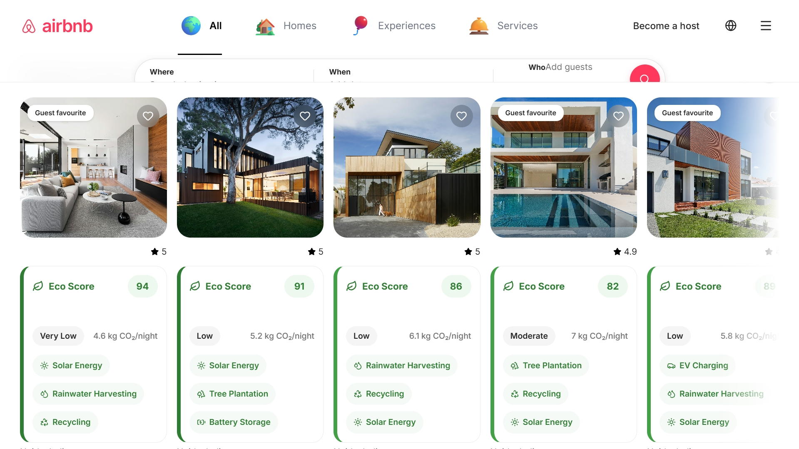
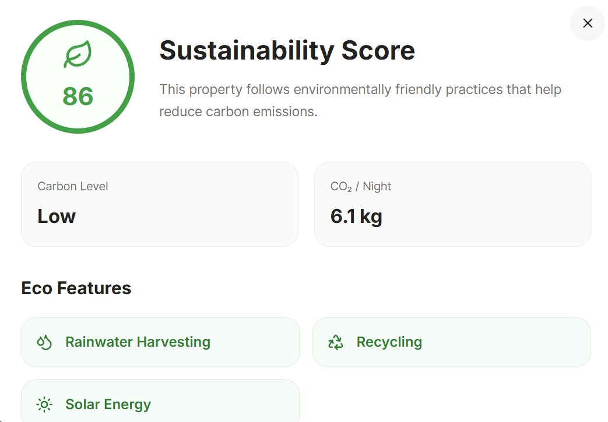

# 🏡 Airbnb Homepage Clone

A modern **Airbnb Homepage Clone** built using **React**, **Vite**, and **Tailwind CSS** as part of a Frontend Internship project. This project recreates the Airbnb homepage while following modern frontend development practices and introduces an original sustainability feature called **Eco Score**, which helps users identify environmentally friendly properties.


## 📸 Screenshots

### Homepage



### Eco Score Popup



---

# ✨ Features

## Airbnb Homepage

- Responsive Airbnb-inspired homepage
- Modern navigation bar
- Expandable search bar
- Property listings
- Experiences section
- Services section
- Guest Favourite badges
- Property ratings
- Beautiful hover animations
- Horizontal scrolling sections
- "See All" cards
- Coming Soon pages

---

## 🌱 Eco Score (Custom Feature)

Unlike the real Airbnb website, this project introduces an **Eco Score System** for every property.

Each listing displays:

- Eco Score
- Carbon Level
- Carbon Emission per Night
- Sustainability Features
- Environmental Tips

Users can click the Eco Score card to open a detailed sustainability popup.

---

## ⚡ Performance Features

- Lazy Loading using React.lazy()
- Suspense Loader
- Error Boundary
- Custom Page Loader
- Modular Component Architecture

---

## 🎨 UI Features

- Responsive Design
- Tailwind CSS
- Smooth Animations
- Hover Effects
- Clean Airbnb-inspired Layout
- Reusable Components

---

# 🛠️ Tech Stack

- React
- Vite
- Tailwind CSS
- React Router DOM
- Lucide React
- JavaScript (ES6+)
- CSS3

---

# 📁 Project Structure

```
airbnb
│
├── public
│
├── src
│   ├── assets
│   ├── components
│   ├── context
│   ├── data
│   ├── pages
│   ├── App.css
│   ├── App.jsx
│   ├── main.jsx
│   └── index.css
│
├── package.json
├── vite.config.js
├── README.md
└── .gitignore
```

---

# 🚀 Installation

Clone the repository

```bash
git clone https://github.com/Kunal20060208/airbnb.git
```

Move inside the project

```bash
cd airbnb
```

Install dependencies

```bash
npm install
```

Start development server

```bash
npm run dev
```

Create production build

```bash
npm run build
```

---

# 📌 Internship Requirements Covered

- ✅ React
- ✅ Tailwind CSS
- ✅ Responsive Design
- ✅ Component-Based Architecture
- ✅ Reusable Components
- ✅ Modern UI
- ✅ Lazy Loading
- ✅ Error Boundary
- ✅ Original Feature (Eco Score)
- ✅ Vercel Deployment

---

# 💡 Future Improvements

- AI Trip Planner 
- Weather Forecast 
- Price Prediction 
- Currency Converter 
- Multi-language Support 
- User Authentication 
- Backend Integration 
- Booking System 
- Dark Mode 
- Maps Integration

---

## Presentation

[📄 Internship Presentation](docs/Internship_Presentation.pptx)

# 👨‍💻 Author

**Kunal Arya**

B.Tech Computer Science Engineering

Manav Rachna International Institute of Research and Studies (MRIIRS)

---

# 📜 License

This project is licensed under the MIT License.

See the [LICENSE](LICENSE) file for details.

---

⭐ If you like this project, consider giving it a star.